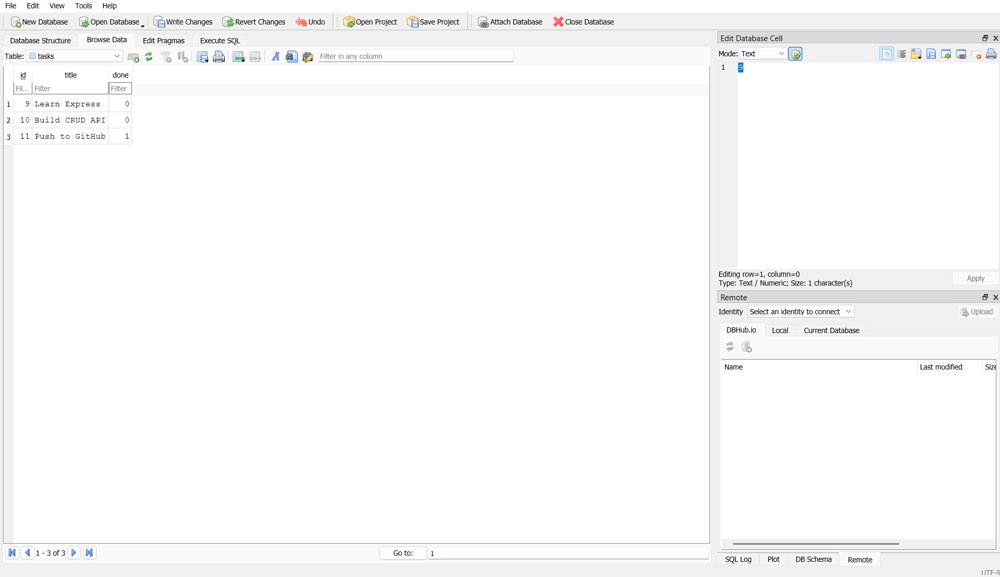

# FlyRank CRUD API

A simple CRUD API built with Node.js, Express, and SQLite as part of the FlyRank Backend AI Engineering Internship.

## Features

- Create tasks
- Read all tasks
- Read task by ID
- Update tasks
- Delete tasks
- Persistent storage using SQLite
- Swagger API Documentation

## Tech Stack

- Node.js
- Express.js
- SQLite
- sqlite3
- Swagger UI
- JavaScript

## Why SQLite?

SQLite was chosen because it is lightweight, requires no separate database server, and stores all data in a single file. It is perfect for learning backend development and small projects.

## Database

The database file is:

```
tasks.db
```

It is automatically created when the application starts if it does not already exist.

## Installation

```bash
git clone https://github.com/SHREYA-G-AMIN/flyrank-crud-api.git
cd flyrank-crud-api
npm install
node server.js
```

## API Endpoints

| Method | Endpoint | Description |
|--------|----------|-------------|
| GET | / | Home |
| GET | /health | Health check |
| GET | /tasks | Get all tasks |
| GET | /tasks/:id | Get task by ID |
| POST | /tasks | Create task |
| PUT | /tasks/:id | Update task |
| DELETE | /tasks/:id | Delete task |

## Swagger Documentation

Open:

```
http://localhost:3000/api-docs
```

## Example SQL Query

```sql
SELECT * FROM tasks;
```

## Database Screenshot





## Author

Created by Shreya for the FlyRank Backend AI Engineering Internship.
